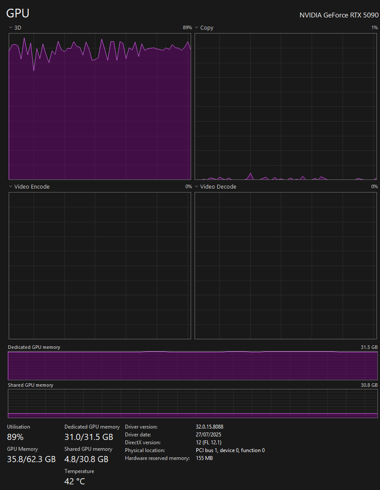
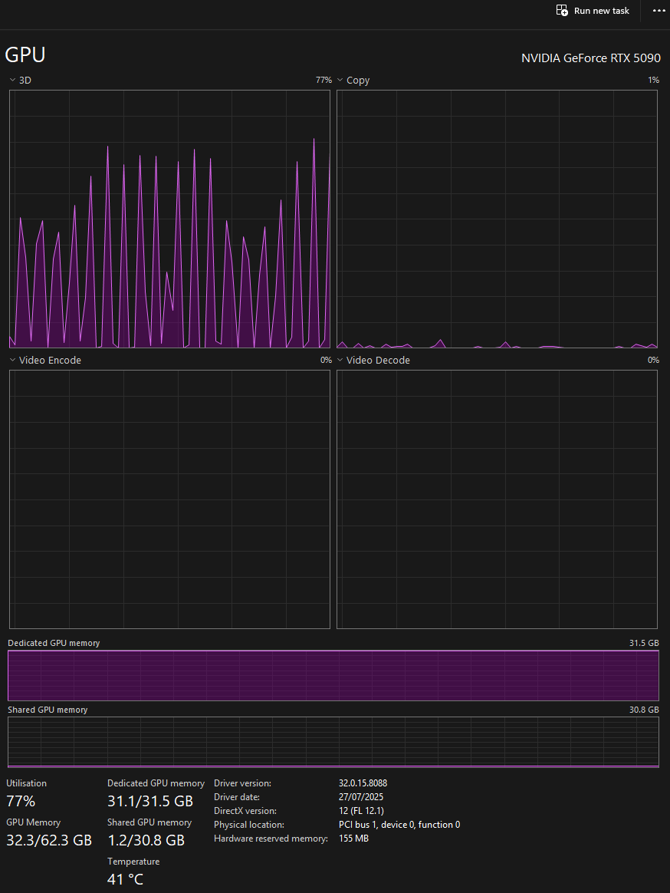
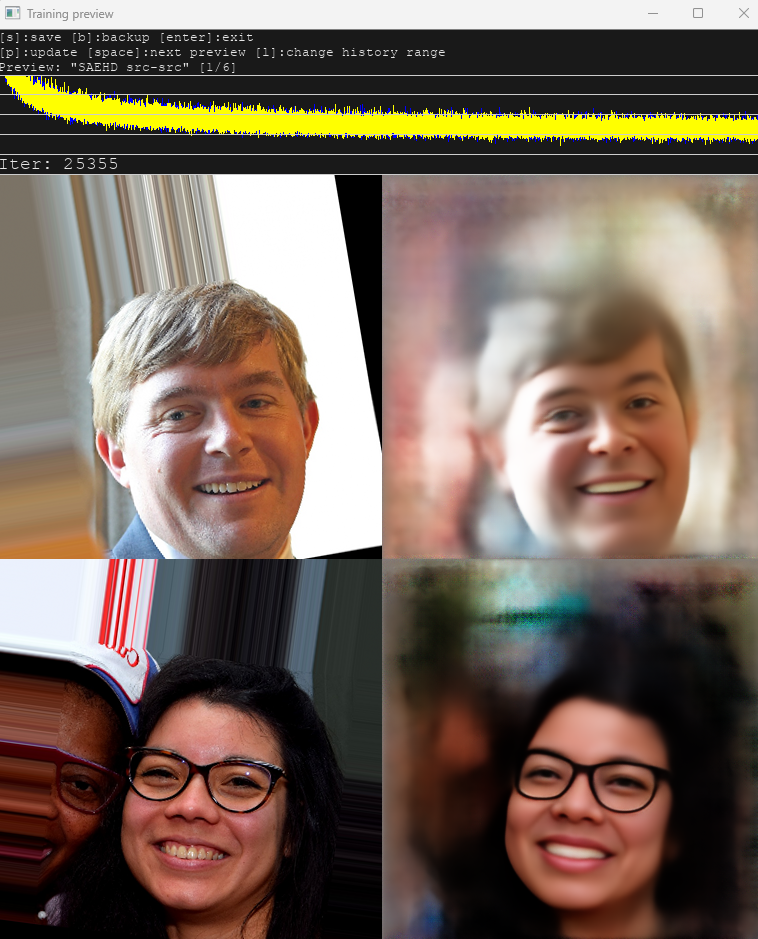
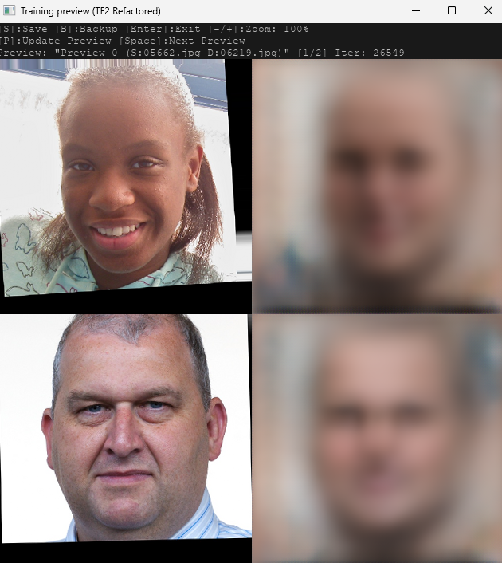

# DeepFaceLab TensorFlow 2.x Migration: A Study in Framework Refactoring and VRAM Optimization

A comprehensive refactoring of the DeepFaceLab training pipeline from TensorFlow 1.x compatibility mode to native TensorFlow 2.x architecture. This project successfully achieved significant VRAM reduction enabling substantially larger model configurations, though replicating the original implementation's nuanced training dynamics presented unexpected challenges.

## Project Status

**Achieved:** 60% VRAM reduction, enabling 3x resolution increase (412x412 → 704x704 at batch size 16)

**Challenge:** Training quality did not achieve parity with original TF1 implementation despite numerical stability

This repository documents both the technical achievements and the obstacles encountered during migration, providing insights into the complexities of modernizing deep learning frameworks.

## Background

DeepFaceLab is a deep learning framework for facial reenactment and face swapping, primarily using autoencoder architectures. The MVE (Mod VAE Extended) fork extended the original framework with additional features but remained built on TensorFlow 1.x compatibility APIs running under TensorFlow 2.6.0.

### Initial Problem Statement

Training on an NVIDIA RTX 5090 (32GB VRAM) consistently hit Out of Memory errors when attempting to train at desired configurations:
- Resolution: 544px or higher
- Batch size: 12+ 
- Model dimensions sufficient for high-quality output

The existing TF1-style gradient checkpointing implementation (`memory_saving_gradients.py`) provided no noticeable VRAM savings. The primary motivation for this refactoring was to leverage TensorFlow 2.x's native `tf.recompute_grad` for gradient checkpointing while modernizing the codebase to current TensorFlow practices.

## Technical Achievements

### VRAM Optimization Results

The migration to native TF2/Keras architecture achieved substantial memory reduction even without successfully implementing gradient checkpointing:

| Configuration | Original TF1 | TF2 Refactor | Improvement |
|--------------|--------------|--------------|-------------|
| Max Resolution (BS=16) | 412x412 | 704x704 | 2.9x pixel count |
| VRAM Usage (412px, BS=16) | ~20GB | ~12GB | 40% reduction |
| VRAM Usage (704px, BS=16) | OOM | ~24GB | Previously impossible |

*Hardware: NVIDIA RTX 5090 (32GB VRAM)*


*Original TF1 implementation at 412x412 resolution, batch size 16*


*TF2 refactor at 704x704 resolution, batch size 16 - nearly 3x the pixel count*

The ability to train at 704x704 resolution represented a fundamental shift in what was possible with the available hardware, even though training quality issues prevented these configurations from being practical for production use.

### Framework Modernization

Successfully migrated the entire training pipeline from TensorFlow 1.x paradigms to native TensorFlow 2.x:

**Training Loop**
- Replaced session-based execution with `tf.GradientTape` for automatic differentiation
- Implemented `@tf.function` graph compilation for the distributed training step
- Integrated `tf.distribute.MirroredStrategy` for multi-GPU training
- Moved from manual session management to eager execution model

**Model Architecture**
- Refactored 20+ custom layers from `LayerBase` to `tf.keras.layers.Layer`
- Migrated architectural components (`Encoder`, `Inter`, `Decoder`) to `tf.keras.Model`
- Implemented proper `build(input_shape)` and `call(inputs, training=False)` methods
- Used `self.add_weight()` for variable creation within layers

**Data Pipeline**
- Wrapped existing Python generators with `tf.data.Dataset.from_generator`
- Defined `output_signature` for type safety
- Integrated with `strategy.experimental_distribute_dataset` for distributed training

**Checkpointing**
- Replaced custom TF1 variable saving with `tf.train.Checkpoint`
- Implemented `tf.train.CheckpointManager` for checkpoint rotation
- Separated model options/history (pickled) from TensorFlow graph variables

### Custom Layer Engineering

Developed Keras-compatible implementations of DeepFaceLab's custom training techniques:

**WScaleConv2D and WScaleDense**
- Subclassed `tf.keras.layers.Conv2D` and `tf.keras.layers.Dense`
- Implemented equalized learning rate (weight scaling) via runtime kernel multiplication
- Kernels initialized from N(0,1), then scaled by `gain / sqrt(fan_in)` during forward pass
- Configurable gain parameter for variance control

**Architecture Components**
- Dependency injection pattern for layer composability
- Centralized layer class selection in top-level model file
- Maintained compatibility with multiple model variants (LIAE-UDT, DF, etc.)

## Technical Challenges

### Primary Challenge: Training Quality Disparity

Despite achieving numerical stability and correct gradient flow, the refactored implementation failed to replicate the original TF1 version's training characteristics:

**Observed Behavior**
- Slow visual convergence compared to original (1500+ iterations with minimal recognizable features)
- Preview outputs remained flat gray/orange/brown throughout early training
- Loss values decreased numerically but didn't correlate with visual improvement
- Decoder output logits exhibited suboptimal range characteristics

**Visual Comparison**

The following screenshots demonstrate the training quality disparity even at very high iteration counts:


*Original TF1 implementation at iteration 25,355 - clear facial features and good reconstruction quality*


*TF2 refactor at iteration 26,549 - visible reconstruction but lower detail and contrast despite similar iteration count*

These preview comparisons illustrate the core challenge: while the TF2 implementation was numerically stable and training progressed (loss decreased), the visual quality and learning speed did not match the original TF1 implementation's characteristics.

**Root Cause Analysis**

Investigation revealed fundamental differences in signal propagation:

1. **Variance Collapse Through Encoder Stack**
   - With Pixel Normalization enabled: Output std collapsed from ~1.0 to ~0.004
   - With Pixel Normalization disabled: Output std reached only ~0.2-0.4 (target: ~1.0)
   - Chain of 5 WScaleConv2D layers showed progressive variance decay despite gain=sqrt(2.0)

2. **Decoder Output Logit Range Issues**
   - Original TF1: Logits naturally constrained to [0,1] range (effectively post-sigmoid)
   - TF2 Refactor: Logits either too constrained ([-0.4, 0.8]) or exploding (thousands)
   - Attempts to tune output layer gain (0.1, 1.0, sqrt(2.0), 2.0) failed to achieve optimal range

3. **WScale Implementation Subtleties**
   - Keras subclassing approach mathematically correct but behaviorally different
   - Suspected incompatibility between custom variable handling and TF2 graph linking
   - Original TF1's manual graph construction exhibited properties not replicated in TF2

### Gradient Checkpointing Investigation

Extensive effort invested in implementing `tf.recompute_grad` yielded disappointing results:

**Implementation Challenges**
- `ValueError` with keyword arguments in custom gradient functions (resolved via positional args)
- `IndexError` from captured loop variables in closures (resolved with `functools.partial`)
- Complex integration with `@tf.function` and distribution strategy

**Performance Characteristics (TensorFlow 2.6.0)**
- No observable VRAM reduction when enabled
- 2x increase in GPU step time due to forward pass recomputation
- Eventually disabled globally for stability and performance

The reasons for gradient checkpointing's ineffectiveness remain unclear - potentially related to TF version, model architecture specifics, or hardware interaction patterns.

### Debugging Journey Highlights

**Import Resolution Errors (Significant Challenge)**

One of the most time-consuming debugging challenges involved resolving a cascade of import errors that emerged during the TF1 to TF2 migration:

- **Circular Dependencies:** TF2's eager execution model and stricter module initialization requirements exposed circular import patterns that worked (by accident) in TF1's lazy graph construction
- **Module Path Resolution:** Differences in how TF1 and TF2 handle Python module paths and relative imports caused numerous `ModuleNotFoundError` and `ImportError` exceptions
- **Systematic Isolation Required:** Each import error had to be debugged individually by:
  * Commenting out entire modules to isolate which imports were failing
  * Tracing import chains through multiple levels of nested dependencies
  * Testing import statements in isolation via Python REPL
  * Restructuring import order and using explicit imports vs. wildcard imports
- **Resolution Strategy:** Methodically refactored import structure through:
  * Explicit module path declarations
  * Breaking circular dependencies by moving shared utilities
  * Initializing modules in specific order within package `__init__.py` files
  * Converting relative imports to absolute where appropriate

This debugging process took several days of dedicated effort as each fix would often reveal new downstream import conflicts. The experience demonstrated the importance of understanding Python's import system deeply when working with complex, interconnected codebases.

**Convolution Depth Mismatch (`ValueError: Depth of input (X) is not a multiple of input depth of filter (Y)`)**
- Most time-consuming issue encountered
- Occurred with custom `Conv2D` layer despite correct Python-level shapes
- Root cause: Incompatibility between TF1-style variable handling and TF2 graph op linking
- Resolution: Switch to standard `tf.keras.layers.Conv2D` (sacrificing wscale feature)

**Distribution Strategy Integration**
- Moving `@tf.function` from model's `train_step` to outer `distributed_train_step` resolved merge_call errors
- Learning rate dropout feature disabled due to conflicts with conditional gradient application in strategy scope

**Loss Function Imports**
- Case sensitivity issues (`MSSimLoss` vs `MsSsimLoss`)
- Transitioning from functional loss helpers to `tf.keras.losses.Loss` subclasses
- Ensuring proper reduction for distributed training

## Comparative Analysis: TF1 vs TF2 Behavior

To understand the disparity, the original TF1 implementation was instrumented with debugging outputs:

**Original TF1 Decoder Outputs (1200-1300 iterations)**
- Image outputs: min≈0.0, max≈1.0, mean≈0.35-0.50
- Mask outputs: min=0.0, max=1.0, mean≈0.30-0.39
- Outputs behaved as if already sigmoid-activated despite no explicit sigmoid in Decoder module

**TF2 Refactor Decoder Outputs (1200-1300 iterations)**
- Image outputs: Highly variable depending on configuration
- With small output gain: min≈-0.4, max≈0.8 (sigmoid→~0.4-0.7, low contrast)
- With higher output gain: min/max in thousands (sigmoid→saturation, noisy output)
- Never achieved the stable [0,1]-like range of original implementation

This fundamental difference in Decoder output characteristics directly explained the poor visual feedback during training. The original implementation's specific combination of custom TF1 layers and graph construction produced self-limiting behavior that was not straightforwardly replicated in the Keras subclassing paradigm.

## Project Evolution and Decision Points

### Development Timeline

1. **Conceptualization Phase (February 2025):** 
   - Initial investigation into gradient checkpointing as primary VRAM optimization technique
   - Research into TensorFlow 2.x's `tf.recompute_grad` capabilities
   - Analysis of original DFL codebase architecture and dependencies
   - Feasibility assessment for framework migration

2. **Planning Phase (March 2025):** 
   - Comprehensive architecture design mapping TF1 components to TF2 equivalents
   - Identified critical components requiring refactoring: layers, models, training loop, data pipeline
   - Planned phased migration strategy to maintain functionality throughout development
   - Documented expected challenges and mitigation approaches

3. **Development & Debugging Phase (April 2025):** 
   - Week 1-2: Core layer migration to Keras architecture
     * Refactored base layers (Conv2D, Dense, Downscale, Upscale)
     * Implemented WScale variants with equalized learning rate
     * Built architectural components (Encoder, Inter, Decoder)
   - Week 2-3: Training loop and distribution strategy implementation
     * Converted session-based training to GradientTape
     * Integrated MirroredStrategy for multi-GPU support
     * Implemented checkpointing with tf.train.Checkpoint
   - Week 3-4: Systematic debugging of complex technical issues
     * **Import Resolution Challenges:** Spent significant time isolating circular dependencies and module path issues one by one
     * Resolved layer compatibility and shape mismatch errors
     * Fixed distribution strategy integration conflicts
     * Debugged numerical stability issues (NaNs, gradient explosion)

4. **Analysis Phase (May 2025):** 
   - Comparative benchmarking with original TF1 implementation
   - Instrumentation of both codebases to identify behavioral differences
   - Detailed variance propagation analysis through network layers
   - Documentation of findings and training quality disparities

5. **Decision Point (May 2025):** 
   - Pivot to enhancing original TF1 codebase after achieving VRAM goals but encountering training quality challenges
   - Focus shifted to FP16 implementation and quality-of-life improvements in proven-stable TF1 version
   - TF2 refactor retained as successful technical demonstration and learning experience

### Strategic Pivot Rationale

After achieving significant VRAM improvements but failing to match training quality, development effort shifted back to the original TF1 MVE codebase with a focus on:

- Implementing stable FP16 training in TF1 for additional VRAM savings
- Enhancing XSeg workflow for better masking
- Improving merger quality-of-life features
- Leveraging new hardware (RTX 5090) for higher-resolution training with proven-stable TF1 implementation

The TF2 refactor successfully demonstrated the feasibility of major VRAM reductions and validated modernization approaches, but the training quality gap made it impractical for production use.

## Repository Structure

```
deepfacelab-tf2-refactor/
├── core/
│   └── leras/                    # Core neural network framework
│       ├── nn.py                 # TF2 initialization, GPU config
│       ├── layers/               # Custom Keras layers
│       │   ├── WScaleConv2D.py  # Custom weight-scaled convolution
│       │   ├── WScaleDense.py   # Custom weight-scaled dense
│       │   ├── Downscale.py     # Downsampling layer
│       │   ├── Upscale.py       # Upsampling layer (depth_to_space)
│       │   ├── ResidualBlock.py # Residual connection block
│       │   └── ...              # Other layer implementations
│       ├── archis/               # Architecture components
│       │   ├── Encoder.py       # Encoder network (tf.keras.Model)
│       │   ├── Inter.py         # Intermediate/latent space network
│       │   └── Decoder.py       # Decoder network
│       ├── losses/               # Loss functions
│       │   ├── DssimLoss.py     # DSSIM loss (tf.keras.losses.Loss)
│       │   └── MsSsimLoss.py    # Multi-scale SSIM loss
│       └── optimizers/           # Custom optimizers
│           └── RMSprop.py       # DFL RMSprop with LR dropout
├── models/
│   ├── ModelBase.py             # Base model utilities
│   └── Model_SAEHD/
│       └── Model.py             # Main SAEHD training model (TF2)
├── mainscripts/
│   └── Trainer.py               # Main training loop (TF2 + Strategy)
├── samplelib/                   # Data pipeline components
│   ├── Sample.py
│   ├── SampleProcessor.py
│   └── SampleGeneratorFace.py
└── main.py                      # Entry point
```

## Key Implementation Details

### Dependency Injection Pattern

Architectural components receive layer classes as constructor arguments rather than importing them directly:

```python
# In Model_SAEHD/Model.py
BaseConv2D_cls = WScaleConv2D  # or tf.keras.layers.Conv2D
BaseDense_cls = WScaleDense

self.encoder = Encoder(
    Conv2D_cls=BaseConv2D_cls,
    Downscale_cls=Downscale,
    # ... other injected classes
)
```

This centralized layer selection enables rapid experimentation with different implementations during debugging.

### WScale Implementation Example

```python
class WScaleConv2D(tf.keras.layers.Conv2D):
    def __init__(self, filters, kernel_size, gain=math.sqrt(2.0), **kwargs):
        super().__init__(
            filters=filters,
            kernel_size=kernel_size,
            kernel_initializer=RandomNormal(mean=0.0, stddev=1.0),
            bias_initializer=Zeros(),
            **kwargs
        )
        self.gain = gain
        self.runtime_scale = None

    def build(self, input_shape):
        super().build(input_shape)
        fan_in = np.prod(self.kernel.shape[:-1])  # kh * kw * in_channels
        self.runtime_scale = self.gain * tf.math.rsqrt(tf.cast(fan_in, tf.float32))

    def call(self, inputs):
        scaled_kernel = self.kernel * self.runtime_scale
        outputs = tf.nn.conv2d(inputs, scaled_kernel, ...)
        # ... bias and activation
        return outputs
```

### Training Loop Structure

```python
@tf.function
def distributed_train_step(dist_inputs):
    per_replica_losses = strategy.run(model.train_step, args=(dist_inputs,))
    return strategy.reduce(tf.distribute.ReduceOp.MEAN, per_replica_losses, axis=None)

# Main loop
for iteration in range(target_iterations):
    batch_data = next(dist_iterator)
    losses = distributed_train_step(batch_data)
    # ... logging, checkpointing
```

## Performance Characteristics

**GPU Step Time**
- Original TF1: ~300-400ms (320px, BS=16)
- TF2 Refactor: ~100-250ms (comparable configuration)
- TF2 with recompute_grad: ~500ms+ (not beneficial)

**Total Iteration Time**
- Dominated by CPU-bound data pipeline (~1.4-2.0s per iteration)
- Profiling identified mask generation (blur/dilate) as primary bottleneck
- GPU improvements offset by data pipeline limitations

## Skills Demonstrated

- Deep learning framework internals (TensorFlow 1.x/2.x)
- Custom layer development and gradient computation
- Distributed training strategy implementation
- Systematic debugging of complex DL systems
- Performance profiling and optimization
- Variance propagation analysis in deep networks
- Software architecture patterns (dependency injection, strategy pattern)
- Technical documentation and project analysis

## Running the Code

**Note:** This codebase is provided for educational and portfolio purposes. It is not recommended for production use due to the training quality issues described above.

### Requirements
- Python 3.6.8
- TensorFlow 2.6.0
- NVIDIA GPU with CUDA support
- Additional dependencies typically bundled with DeepFaceLab distributions

### Basic Usage

Run the training batch file:
```bash
6) train SAEHD.bat
```

The batch file will launch the training script and present interactive prompts for model configuration including resolution, architecture type, loss functions, batch size, and other training parameters. Configuration options are maintained from the original DFL implementation.

## Lessons Learned

1. **Framework Migration Complexity:** Even mathematically equivalent implementations can exhibit different training dynamics due to subtle differences in operation ordering, variable initialization, or graph construction.

2. **Debugging Deep Learning Systems:** Requires systematic isolation of components, extensive instrumentation, and comparative analysis with known-good baselines.

3. **Custom Layer Development:** Subclassing modern frameworks requires careful attention to internal implementation details that may not be apparent from API documentation alone.

4. **VRAM Optimization:** Significant memory reductions possible through framework-level changes even without specialized techniques like gradient checkpointing.

5. **Production Readiness vs. Technical Achievement:** A successful refactoring requires not just numerical correctness but behavioral equivalence across all relevant metrics.

## Future Directions

Potential paths for continued investigation:

- Test with newer TensorFlow versions (2.10+) for improved gradient checkpointing
- Explore alternative variance normalization techniques (Group Norm, Layer Norm variants)
- Investigate mixed-precision training implementation in TF2 context
- Consider PyTorch migration for comparison of framework differences
- Detailed profiling of original TF1 graph construction to identify subtle differences

## License

This refactoring work maintains the original DeepFaceLab license:

**GNU General Public License v3.0 (GPLv3)**

The original DeepFaceLab framework and this derivative refactoring work are licensed under the GNU General Public License version 3. This is a free, copyleft license that ensures:

- Freedom to use, study, modify, and distribute the software
- Any modifications or derivative works must also be distributed under GPLv3
- Source code must be made available when distributing the software
- Changes made to the code must be documented

See the full license text at: https://www.gnu.org/licenses/gpl-3.0.html

Original DeepFaceLab: Copyright (C) 2018-2020 Ivan Petrov, Petr Yaroshenko, and contributors

---

**Project Timeline:** February 2025 - May 2025  
**AI Assistance:** Google Gemini 2.5 Pro (March-April 2025)  
**Hardware:** NVIDIA RTX 5090 (32GB), AMD Ryzen 9950X3D  
**Development Approach:** Iterative refactoring with systematic debugging and comparative analysis
